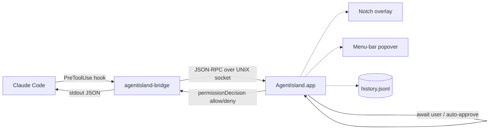

<div align="center">

# 🐝 Agent Island

**A native macOS menu-bar companion for Claude Code, Codex, and friends.**
Approve tool calls from your notch. See every agent at a glance.
Auto-approve safely. Pick options without leaving the notch.

### 🌐 [**See it in action → 0xjustben.github.io/agent-island**](https://0xjustben.github.io/agent-island/)

Interactive demo · feature grid · FAQ · install guide

---

[](#requirements)
[](#building-from-source)
[](#tests)
[](LICENSE)
[](#privacy)

</div>

---

## What it does

Agent Island intercepts every permission request your AI agents make and
surfaces it in the macOS camera-notch — the one bit of screen real-estate
that's always visible, no matter what app is in front. Click ✓ or ✗ to
approve or deny. Toggle auto-approve for safe tools. See multi-choice
questions (`AskUserQuestion`, `ExitPlanMode`) right in the notch and pick
the option with one click — the choice is injected back into the agent's
terminal automatically.

<details>
<summary><b>📺 Why this exists</b></summary>

Long-running agents need permission checks. The default workflow is:
agent pauses → you switch back to its terminal → read the prompt → type
a number → switch back to what you were doing. Multiply by 50 tool calls
per session and the context-switch cost adds up.

Agent Island lets you stay in your current app. Permission cards drop
from the notch, decisions are one click, and the agent never knows you
weren't watching.

</details>

---

## ✨ Features

- **Notch-anchored approvals** for `Read`, `Edit`, `Write`, `Bash`, etc.
- **AskUserQuestion picker** — agent's multi-choice options rendered as
  clickable cards, answer typed back into the right terminal.
- **ExitPlanMode preview** — full plan markdown rendered before you approve.
- **Auto-approve toggles** — global "everything," per-tool allow-list, or
  "always allow this tool" inline on the approval card.
- **Danger detector** — blocks auto-approve for `rm -rf`, `dd`, `curl|sh`,
  `git reset --hard`, SQL drops, fork bombs, and more. Always shows a red
  ⚠ warning banner.
- **Active session list** in the menubar popover with project & source
  filter chips, jump-to-terminal, history search.
- **Bridge auto-discovery** so the CC hook just works no matter where you
  drag the app.
- **Idle sounds** with debouncing so you don't get a double-ding for
  every agent turn.
- **Zero telemetry**, local sockets only, history stored as plain JSONL
  on your disk.

---

## 🎬 See it in action

Live interactive demo, animated notch, feature grid, FAQ:

### **[👉 0xjustben.github.io/agent-island](https://0xjustben.github.io/agent-island/)**

---

## 🧠 How it works



1. The app writes a tiny bridge launcher into `~/.agent-island/bin/`
   and adds it as a `PreToolUse` hook in `~/.claude/settings.json`.
2. Every time Claude is about to run a tool, the hook pipes the request
   over a UNIX socket to the running app.
3. The app shows the card in the notch (or popover) and waits for you
   — unless auto-approve fires first.
4. Decision flows back as a `hookSpecificOutput.permissionDecision`
   which Claude honors natively.

---

## 🚀 Install

### From a release DMG (recommended)

> Coming once first release tag lands. Will be a notarized DMG via the
> GitHub Actions release workflow.

### Build from source

<details open>
<summary><b>Steps</b></summary>

```bash
git clone https://github.com/<you>/agent-island.git
cd agent-island

# (Optional, recommended) install a stable code-signing identity so
# Accessibility/Automation permission grants survive every rebuild.
./scripts/setup-signing-identity.sh

# Build the universal .app bundle.
./scripts/build-app.sh debug
open build/AgentIsland.app
```

First launch will:

- copy `agentisland-bridge` into `~/.agent-island/bin/`
- register the `PreToolUse` hook in `~/.claude/settings.json` (a backup is saved)
- prompt for **Accessibility** (so click-to-pick-option can type for you)
- prompt for **Automation > System Events** (fallback keystroke path)

</details>

<details>
<summary><b>Requirements</b></summary>

- macOS 14 (Sonoma) or newer — earlier versions don't have the notch APIs
- Swift 5.10 toolchain (Xcode 15.4+)
- Claude Code installed (`~/.claude/settings.json` is where the hook lands)

</details>

---

## ⚙️ Configuration

Settings live at `~/.agent-island/config.json` and are exposed in the
menubar popover footer:

| Toggle | What it does |
|---|---|
| **Display** | `Notch` / `Bar` / `Menu only` |
| **Auto-heal** | Re-add the hook to `settings.json` every 30s if removed |
| **Sounds** | Play the soft permission/notification chimes |
| **Auto-approve all** | Skip the human gate for every tool (still blocks danger-pattern Bash) |
| **Always allow `<Tool>`** | Per-tool allow-list buttons on the card itself |
| **Lock to screen** | Pin the notch to one display instead of following the mouse |

---

## ⌨️ Keyboard shortcuts

| Key | Action |
|---|---|
| `⌃⇧V` | Toggle the panel from anywhere |
| `⌘Y` | Approve the focused card |
| `⌘N` | Deny the focused card |
| `⌘1` … `⌘9` | Pick option N in an `AskUserQuestion` card |
| `↑ ↓` | Move selection in the session list |
| `↵` | Jump to the selected session's terminal |

---

## 🔒 Privacy

- **Local sockets only.** The bridge talks to the app over `/tmp/agentisland.sock`
  (mode 0600). Nothing ever leaves your Mac.
- **No telemetry.** No analytics SDK, no crash reporter, no phone-home.
  `noTelemetry: true` is the default and the only behavior.
- **Plain-text history.** Every decision lands in
  `~/Library/Logs/AgentIsland/history.jsonl`. Inspect or delete freely.

---

## 🛠️ Architecture

<details>
<summary><b>Module layout</b></summary>

```text
Sources/
├── AgentIslandCore/        # Event router, session aggregator, models, paths
├── AgentIslandAdapters/    # Claude Code adapter + hook merger
├── AgentIslandTerminals/   # Per-app jumpers (iTerm2, Terminal, Ghostty, …)
├── AgentIslandLauncher/    # Bridge launcher script + JXA cleanup
├── agentisland/            # The .app — menu bar, notch view, controllers
└── agentisland-bridge/     # The CLI hook — talks JSON-RPC to the app
```

</details>

<details>
<summary><b>How keystrokes get into your terminal</b></summary>

Three-tier strategy in `KeystrokeInjector.swift`:

1. **`CGEvent.post(tap: .cgAnnotatedSessionEventTap)`** — primary. Needs
   Accessibility. Reliable across every terminal once the app has a stable
   codesign identity.
2. **TIOCSTI ioctl** on the resolved tty — fallback. No permissions, but
   only works when the bridge could walk up to a real tty (CC pipes stdin
   so we have to walk parent processes).
3. **AppleScript `System Events` keystroke** — last-ditch fallback. Needs
   Automation permission.

</details>

<details>
<summary><b>Why a self-signed identity matters</b></summary>

macOS TCC (Privacy & Security) binds Accessibility/Automation grants to a
code-signing **designated requirement**. Ad-hoc signed binaries have no
DR — every rebuild changes the cdhash and TCC invalidates the grant.
`scripts/setup-signing-identity.sh` walks you through making a self-signed
cert once via Keychain Access; `build-app.sh` then signs every build with
the same identity so the grant survives forever.

</details>

---

## 🧪 Tests

```bash
swift test --parallel
```

Covers: event routing, approval queue, dedup, dangerous-command
detection, session aggregator, AskUserQuestion synthesis, terminal
jumpers, hook merger, notch geometry, JSON-RPC codec, sound resolver.

**129 tests, 0 failing.**

---

## 🗺️ Roadmap

- [x] Bridge + socket + Claude Code hook
- [x] Notch panel, multi-screen, brand UI
- [x] Session aggregator + Ask + auto-approve
- [x] PreToolUse blocking + danger detector + AskUserQuestion picker
- [x] Stable self-signed identity workflow
- [ ] Remote bridge UX (key pairing, settings panel)
- [ ] Codex / Kimi adapters
- [ ] First public release: notarized DMG via GitHub Actions

---

## 🤝 Contributing

Bug reports and PRs welcome. See [CONTRIBUTING.md](CONTRIBUTING.md).

Quick checks before opening a PR:

```bash
swift build && swift test --parallel
./scripts/build-app.sh debug      # Make sure the bundle still builds
```

---

## 📜 License

MIT. See [LICENSE](LICENSE).

<div align="center">

<sub>🐝 Built with help from Claude. The companion learned the workflow as the workflow learned itself.</sub>

</div>
